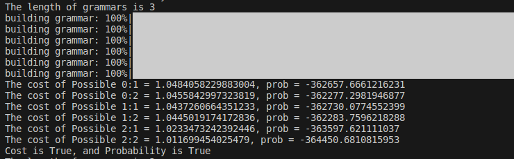

Dillon Mee
Ling 696 Presentation

### Yet Another look at Unsupervised Morphological Analysis

A topic that has long interested me is unsupervised morphological analysis, which is perhaps a folly because in many contexts (especially high resource contexts) this can be seen as a solved problem. It is perhaps doubly so a folly because morphology by its very definition is interested in units of meaning, and the meaning itself is very likely opaque to any kind of statistical analysis.

But as Goldsmith, 2001 notes: "Developing an unsupervised learner using raw text data as its sole input offers several attractive aspects, both theoretical and practical. At its most theoretical, unsupervised learning constitutes a (partial) linguistic theory, producing a completely explicit relationship between data and analysis of that data." That's a compelling thought!  

### What's already been done (by others(20 years ago))

Goldsmith, 2001 utilizes Minimum Description Length (MDL), especially around signatures, which can be thought of as morphological patterns that apply to the same stems. For example one signature might be [NULL.ed.ing.s] in which each of the four morphemes present may combine with words such accent, add, or alert. These signatures in combination with Minimum Description Length and some heuristics produce a fairly powerful unsupervised morphological parser. 

Schone & Jurafsky, 2000 use latent semantic analysis to explore a morphology. Basically a morph + affix is only accepted if they are semantically similar by creating vectors to be analyzed for distance akin to distributional semantics. 

Creutz and Lagus, 2002 also use MDL, but with some interesting additions, claiming to be especially suitable for agglutinative languages. Similar to Goldsmith the aim is to describe the data with a concise 'codebook'. Notably they use a 'dreaming' stage which "Due to the online learning, as the number of processed words increases, the quality of the set of morphs in the codebook gradually improves. Consequently, words encountered in the beginning of the input data, and not observed since, may have a sub-optimal segmentation in the new model, since at some point more suitable morphs have emerged in the codebook." I think this idea is fascinating, and provokes the question: to what extent does our model need to be able to re-evaluate itself?

Additionally I appreciated their discussion on what segments verses morphs, "The practical purpose of the segmentation is to provide a vocabulary of language units that is smaller and generalizes better than a vocabulary consisting of words as they appear in text. Such a
vocabulary could be utilized in statistical language modeling, e.g., for speech recognition. Moreover, one could assume that such a discovered morph vocabulary would correspond rather closely to linguistic morphemes of the language." 

### My approach

The landscape of AI has changed dramatically over the past few years, and to be honest I kind of doubt that I can improve upon any kind of morphological parsing using traditional techniques alone. I've built a system which is statistically aware. As an initial step I take every word and decompose it to every possible combination. This allows me to observe conditional probabilities, which can be loosely seen in the following element: 

"myst": {
            "count": 12,
            "prep": 12.0,
            "sufp": 0.0,
            "word": 0,
            "before": {
                "#": 12
            },
            "after": {
                "#": 0,
                "r": 12,
                "ery": 8,
                "e": 12,
                "er": 12,
                "y": 8,
                "ry": 8,
                "eri": 4,
                "iou": 3,
                "u": 3,
                "erio": 3,
                "ous": 3,
                "rio": 3,
                "i": 4,
                "ious": 3,
                "us": 3,
                "erious": 3,
                "riou": 3,
                "ou": 3,
                "eriou": 3,
                "s": 4,
                "rious": 3,
                "ri": 4,
                "o": 3,
                "io": 3,
                "ries": 1,
                "eries": 1,
                "es": 1,
                "ie": 1,
                "ies": 1,
                "rie": 1,
                "erie": 1
            },
            "coverage": [
                "mystery",
                "mysterious",
                "mysteries"
            ]
        }

This can be used to create a normalized probability for an element relating to prefix, suffix, or stem, in log form for example 'ed' : {'prefixes': -16.345298164497237, 'suffixes': -11.328846485079541, 'stems': -20.730409509484346}. In this case it is most likely to be a suffix, then a prefix, and then it's possible that it's a stem. Note that it is possible that from the outset a particular affix is impossible, for example 'ng' {'prefixes': -inf, 'suffixes': -11.872986534864534, 'stems': -20.886877424376046}, which is never observed as word initial and thus is considered an impossible prefix. (Of course it's possible that a prefix is observed but never in a word initial stage, in which case it's a clear example of needing more data.)

From there, I begin a machine learning cycle where a 'grammar' is built up of a set of probabilistically chosen stems, prefixes, and suffixes. Then every observed word is attempted to be built from these elements, if it is not able to, then it generates itself as a single rule. If every word is independently generated, then we have a baseline of 1, which is to say each rule requires a single rule to build itself. If, however, a word is recognized as decomposable according to the given elements, it generates a rule, which might look like the following:

            {
            "stems": [
                "ble",
                "ific",
                "ified",
                "ibly"
            ],
            "prefixes": "horr",
            "suffixes": null,
            "probability": [
                -19.01185090759576,
                -25.588757023946993,
                -26.50307068376006,
                -28.265159799863046
            ],
            "generates": [
                [
                    "horrble",
                    "horr-i-ble"
                ],
                [
                    "horrific",
                    "horr-ific"
                ],
                [
                    "horrified",
                    "horr-ified"
                ],
                [
                    "horribly",
                    "horr-ibly"
                ]
            ]
        }

Note the obvious: my machine is backwards! (which is easily fixed by relabeling). It's a work in progress. :/. 

The fun, super machine-learny aspect of this, is that grammars are compared against each other with relation to MDL, and the best is passed on to be the source for future iterations to clone from. At every step it will attemp to do one of the following, and then evaluate if any of the changes, made a more concise and/or more probable grammar.
* grow, add new elements for consideration
* mutate, take elements, look for similarly shaped elements and check their probability. If their probability is more, then mutate to that element. 
* shrink, take elements, check to see if their productivity is less than average, and if so, remove the element. 

These grammars are iteratively built and replaced with better grammars, until after a sequence of failures to improve, it passes its best grammar out.

### Analysis & Next steps
This project is fun! I'm also worried that it's pointless to pursue morphological parsing on its own. This model, like Creutz and Lagus's model is able to learn online, and emulates a similar function to dreaming, which is to say able to make a mistake by following a particular morphemic possibility, and later recover from it, as new data is provided.

Like these other models it's able to succeed (sort of, so far) in a completely unsupervised context (aside from tokenization), but I think that in itself it needs a more distinct identity from what has come before. 

Therefore I think that showing elements of the analysis to the logic of an LLM. For building the model, I gave it English in orthography (easiest for me to follow), and for an accomplished LLM to parse English morphology is trivial; however, I suspect that even in novel language situations, an LLM paired with traditional methods could get the best of both worlds. 

In section 8 of the Goldsmith paper, he describes a 'Triage' section, in which, "the goal of triage is to determine how many stems must occur in
order for the data to be strong enough to support the existence of a linguistically real signature." In many ways this triage section is akin to the 'dreaming' that Creutz and Lagus employ in which a more learned model needs to go back and apply that learning to earlier sections. Of triage, Goldsmith writes, "On the whole, the effects are quite good, but by no means as close as one would like to a human’s decisions in a certain number of cases." 

And here is where all the work that's left to be done sits (how many days until the paper is due?). Admittedly I don't yet have a clear picture on how best to leverage an LLM. My initial intuitions are that the LLM can make reasoned decisions on whether a signature (to borrow Goldsmith's term) should be split apart, or combined. He describes this in relation to his own triage algorithm, with the word `just`. 

> For example, the signature NULL.ine.ly is motivated just for the stem just.
Under the former triage criterion, justine and justly would be treated as unanalyzed
words, whereas under the latter, just and justly would be made members of the (large)
NULL.ly signature, and just and justine might additionally be treated as comprising
parts of the signature NULL.ine along with bernard, gerald, eng, capitol, elephant, def, and
sup (although that would involve permitting a single stem to participate in two distinct
signatures).

I'd like to see if I can get a working hybrid prototype and test that against novel langauge data with an LLM. The novel part is essential because otherwise the LLM would just cheat and parse it by prior language experience. But in novel situations, I think it's likely that the LLM's multilingual knowledge would act as a powerful AI augmentation to traditional machine learning techniques. 

#### Bibliography

Creutz, M., & Lagus, K. (2002). Unsupervised discovery of morphemes. arXiv preprint cs/0205057.

Goldsmith, J. (2001). Unsupervised learning of the morphology of a natural language. Computational linguistics, 27(2), 153-198.

Schone, P., & Jurafsky, D. (2000). Knowledge-free induction of morphology using latent semantic analysis. In Fourth Conference on Computational Natural Language Learning and the Second Learning Language in Logic Workshop.

